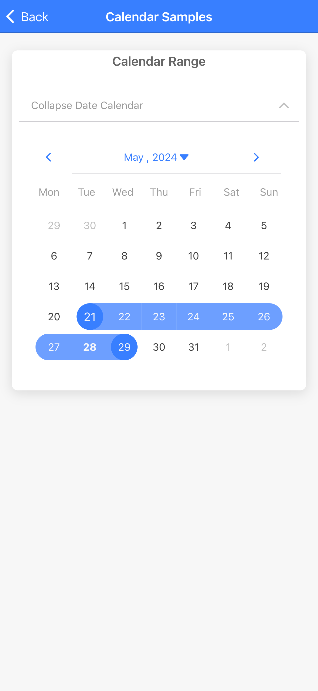
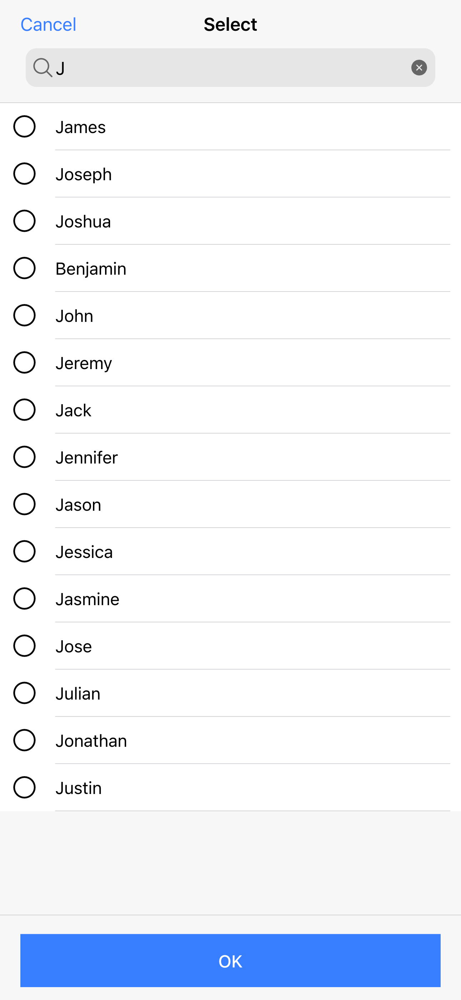
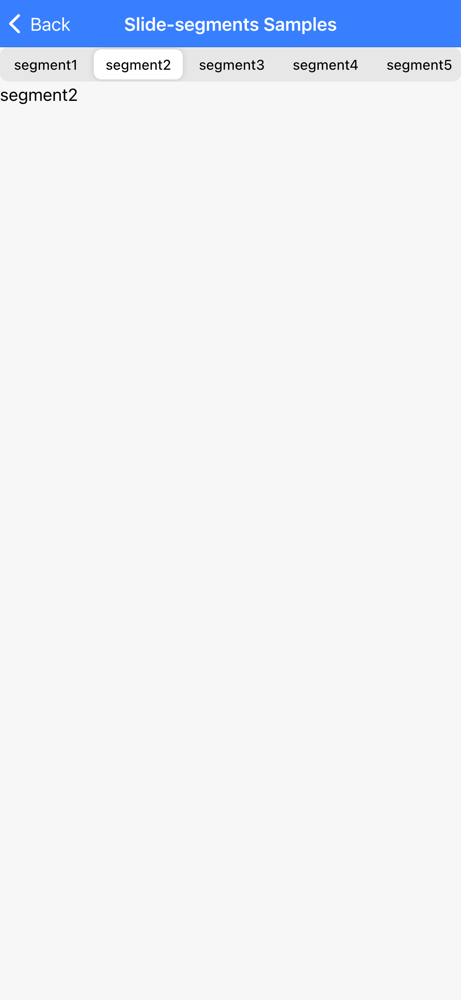
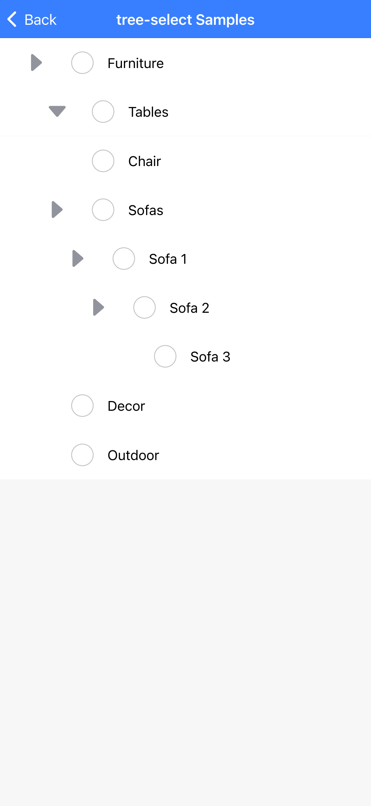

## Ionic Component Snippets

This repository showcases demos and libraries that aren't officially supported by Ionic yet, but can be useful for developers and their apps. Feel free to explore and use the featured components!

**Note:** Third-party components may not be actively maintained and could introduce compatibility issues in future Ionic releases. Use them with caution and consider potential upgrade challenges.

## Preivew

### Online Preview

[Preview URL](ionic-component-snippets.vercel.app)

## Component Categories

This repository is categorized into two sections:

- **Officially Supported Components:** These components are part of the Ionic framework and receive ongoing maintenance from the Ionic team.
- **Third-Party Components:** These components are developed by the community and offer additional features beyond the core Ionic framework.

## Officially Supported Components(work in progress)

- **@ionic-team/capacitor-barcode-scanner:** Capacitor plugin using Outsystems Barcode libs.
  [The original repository](https://github.com/ionic-team/capacitor-barcode-scanner)

## Third-Party Components

- **@calendar ([Library](https://github.com/LennonReid/ionic-component-snippets/tree/main/libs/components/calendar) | [Sample](https://github.com/LennonReid/ionic-component-snippets/tree/main/libs/samples/calendar)):** Provides a feature-rich calendar component for date and time selection.
  
  [The original repository](https://github.com/HsuanXyz/ion2-calendar)

- **@select-search ([Library](https://github.com/LennonReid/ionic-component-snippets/tree/main/libs/components/select-search) | [Sample](https://github.com/LennonReid/ionic-component-snippets/tree/main/libs/samples/select-search)):** Enhances Ionic's native select component with additional functionalities.
  [The original repository](https://github.com/eakoriakin/ionic-selectable)
  

- **@code-scanner ([Library](https://github.com/LennonReid/ionic-component-snippets/tree/main/libs/components/code-scanner) | [Sample](https://github.com/LennonReid/ionic-component-snippets/tree/main/libs/samples/code-scanner)):** Integrates barcode scanning functionality into your Ionic app.
  [The original repository](https://github.com/robingenz/ionic-capacitor-barcode-scanner)

- **@slide-segments ([Library](https://github.com/LennonReid/ionic-component-snippets/tree/main/libs/components/slide-segments) | [Sample](https://github.com/LennonReid/ionic-component-snippets/tree/main/libs/samples/slide-segments)):** A custom component combining Swiper and Ion-Segment, offering features like height adaptation and on-demand loading.
  

* **@tree-select ([Library](https://github.com/LennonReid/ionic-component-snippets/tree/main/libs/components/tree-select) | [Sample](https://github.com/LennonReid/ionic-component-snippets/tree/main/libs/samples/tree-select)):** - Provides a tree view component for hierarchical data visualization.
  
  [The original repository](https://github.com/heyligengregory/ionic-tree-view)

**We welcome contributions!** If you've found a useful component that isn't listed here, feel free to submit a pull request to add it.
